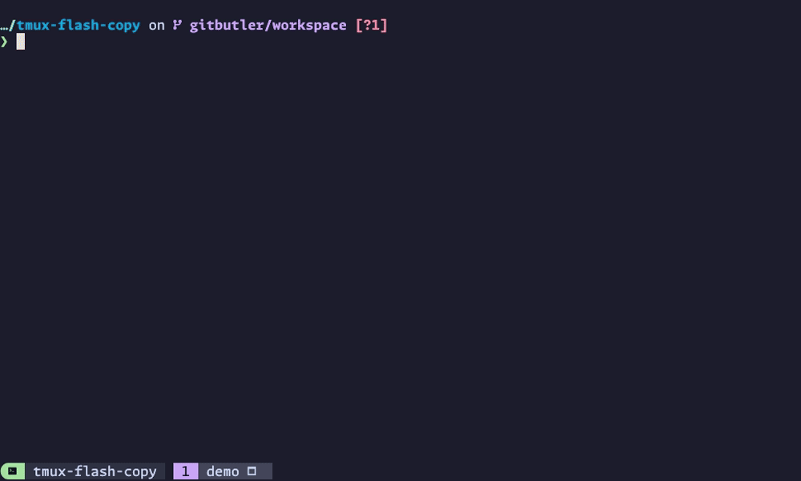

# ⚡📋 tmux-flash-copy

A tmux plugin inspired by [flash.nvim](https://github.com/folke/flash.nvim) that enables you to search visible words in the current tmux pane, then copy that word to the system clipboard by pressing the associated label key.



## Features

- **Dynamic Search**: Type to filter words in real-time as you search.
- **Overlay Labels**: Single key selection with labels overlayed on matches in the pane.
- **Dimmed Display**: Non-matching content is dimmed for visual focus.
- **Clipboard Copy**: Selected text is immediately copied to the system clipboard.
- **Auto-paste Mode**: Optional automatic pasting of selected text into the pane.
- **Configurable Word Boundaries**: Honours tmux's `word-separators` by default, with override support.

## Requirements

- [tmux](https://github.com/tmux/tmux) 3.2+ (tested with tmux 3.6a)
- [Python](https://www.python.org) 3.9+ (tested with Python 3.14.2)

## Installation

### Using TPM (recommended)

1. Install [TPM (Tmux Plugin Manager)](https://github.com/tmux-plugins/tpm).

2. Add `tmux-flash-copy` to your `~/.tmux.conf`:

    ```bash
    set -g @plugin 'kristijan/tmux-flash-copy'
    ```

3. Start tmux and install the plugin.

    Press `<tmux_prefix> + I` (capital i, as in Install) to install the plugin.

    Press `<tmux_prefix> + U` (capital u, as in Update) to update the plugin.

## Usage

1. Press the bind key (default: `<tmux_prefix> S-f` (that's `<tmux_prefix> shift+f`)) to activate the search.
2. Type to search for words in the pane. The search is dynamic and updates as you type.
3. Matching words will be highlighted in yellow with single-character labels in green.
4. Press the label key corresponding to the word you want to copy.
5. The selected text is immediately copied to your clipboard, and you are returned to your pane.

### Keybindings when search is active

| Keybinding       | Action                                                                    |
| ---------------- | ------------------------------------------------------------------------- |
| `Ctrl+U`         | Clear the entire search query                                             |
| `Ctrl+W`         | Clear the previous word                                                   |
| `Enter`          | Copy the first match (determined by `@flash-copy-reverse-search` setting) |
| `Ctrl+C` / `ESC` | Cancel and close the popup without copying                                |

## Customisation

### Configuration options

The following configuration options are supported. Default values are listed, with overrides to be added to your tmux configuration (`~/.tmux.conf`).

#### General options

| Option                                                                 | Description                                                |
| ---------------------------------------------------------------------- | ---------------------------------------------------------- |
| [`@flash-copy-bind-key`](#flash-copy-bind-key-default-s-f)             | Key binding to activate tmux-flash-copy                    |
| [`@flash-copy-ui-mode`](#flash-copy-ui-mode-default-popup)             | Configures which ui-mode to use                            |
| [`@flash-copy-word-separators`](#flash-copy-word-separators)           | Characters that define word boundaries                     |
| [`@flash-copy-auto-paste`](#flash-copy-auto-paste-default-off)         | Controls whether the selected text is automatically pasted |
| [`@flash-copy-case-sensitive`](#flash-copy-case-sensitive-default-off) | Case-sensitive searching                                   |
| [`@flash-copy-reverse-search`](#flash-copy-reverse-search-default-on)  | Direction of label assignment when searching               |
| [`@flash-copy-debug`](#debugging)                                      | Enable debug logging                                       |

#### Prompt

| Option                                                                                                      | Description                                                |
| ----------------------------------------------------------------------------------------------------------- | ---------------------------------------------------------- |
| [`@flash-copy-prompt-position`](#flash-copy-prompt-position-default-bottom)                                 | Controls where the prompt is positioned in the pane window |
| [`@flash-copy-prompt-indicator`](#flash-copy-prompt-indicator-default-)                                     | Customises the prompt indicator                            |
| [`@flash-copy-prompt-colour`](#flash-copy-prompt-colour-default-0331m---bold)                               | Customises the prompt indicator colour                     |
| [`@flash-copy-prompt-placeholder-text`](#flash-copy-prompt-placeholder-text-default-search)                 | Customises prompt placeholder text                         |
| [`@flash-copy-prompt-separator-colour`](#flash-copy-prompt-separator-colour-default-033385242m---dark-grey) | Customises the prompt separator line colour                |

#### Matched text and labels

| Option                                                                                       | Description                                                                           |
| -------------------------------------------------------------------------------------------- | ------------------------------------------------------------------------------------- |
| [`@flash-copy-highlight-colour`](#flash-copy-highlight-colour-default-033133m---bold-yellow) | Customises the colour used to highlight the matched portion of text in search results |
| [`@flash-copy-label-colour`](#flash-copy-label-colour-default-033132m---bold-green)          | Customises the colour used for match labels                                           |

___

#### `@flash-copy-bind-key` (default: `S-f`)

Customise the key binding to activate tmux-flash-copy.

The default binding is `S-f` (Shift+F), which when combined with your tmux prefix becomes `<prefix> S-f`.

```bash
# Change the key binding to Ctrl+F
set -g @flash-copy-bind-key "C-f"

# Or use Alt+F
set -g @flash-copy-bind-key "M-f"
```

#### `@flash-copy-ui-mode` (default: `popup`)

Controls how the interactive search interface is displayed.

- `popup`: Renders a borderless tmux popup as an overlay to the calling pane (default behaviour)
- `window`: Creates a new temporary tmux window

```bash
# Use window mode (fullscreen search in a new window)
set -g @flash-copy-ui-mode "window"
```

#### `@flash-copy-word-separators`

Customise the characters that define word boundaries.

Priority order.

  1. **First**: Check @flash-copy-word-separators (custom user override)
  2. **Fallback**: Read tmux's built-in word-separators window option (can be overriden in `~/.tmux.conf`)

This allows you to control what constitutes a "word" for the plugin. This is particularly useful when working with configuration strings like `#{@variable_name}` where you want `@` and `}` to be word boundaries.

```bash
# Use custom word separators (overrides tmux's word-separators)
set -g @flash-copy-word-separators ' ()":,;<>~!@#$%^&*|+=[]{}?'

# To add single quote to the separators
set -ag @flash-copy-word-separators "'"
```

#### `@flash-copy-auto-paste` (default: `off`)

Controls whether the selected text is automatically pasted into the pane after copying.

- `on` or `true`: Copies the text AND pastes it into the pane
- `off` or `false`: Only copies the text to the clipboard (default behaviour)

```bash
# Enable auto-paste (copies and pastes the text)
set -g @flash-copy-auto-paste "on"
```

#### `@flash-copy-case-sensitive` (default: `off`)

Controls whether search is case-sensitive or case-insensitive.

- `on` or `true`: Search is case-sensitive (e.g., `Test` will not match `test`)
- `off` or `false`: Search is case-insensitive, ignoring case differences (default behaviour)

```bash
# Enable case-sensitive search
set -g @flash-copy-case-sensitive "on"
```

#### `@flash-copy-reverse-search` (default: `on`)

Controls the direction of label assignment when searching:

- `on` or `true`: Labels are assigned from bottom to top
- `off` or `false`: Labels are assigned from top to bottom

Setting to `off` is useful if you have your `@flash-copy-prompt-position` at the top of the screen. This means matches are assigned closer to your prompt.

```bash
# Switch to top-to-bottom search
set -g @flash-copy-reverse-search "off"
```

#### `@flash-copy-prompt-position` (default: `bottom`)

Controls where the prompt is positioned in the pane window.

- `bottom`: Prompt is displayed at the bottom (default)
- `top`: Prompt is displayed at the top

This is independent of the `@flash-copy-reverse-search` setting, allowing you to combine any desired configuration.

```bash
# Place prompt at the top of the popup
set -g @flash-copy-prompt-position "top"
```

#### `@flash-copy-prompt-indicator` (default: `>`)

Customises the prompt indicator or string displayed before the search input.

- Default: A single `>` character
- Can be set to any string (e.g., `>>>`, `❯`, `$`, `λ`)

```bash
# Use a different prompt character
set -g @flash-copy-prompt-indicator "❯"

# Use multiple characters as prompt
set -g @flash-copy-prompt-indicator ">>>"
```

#### `@flash-copy-prompt-colour` (default: `\033[1m` - bold)

Customises the ANSI colour code applied to the prompt indicator. This allows you to style the prompt with different colours and formatting (bold, dim, etc.).

- Default: `\033[1m` (bold)
- Accepts any valid ANSI colour code (see [ANSI colour codes](#ansi-colour-codes) section below)
- The colour applies only to the prompt indicator, not the search input

```bash
# Use bold red for the prompt
set -g @flash-copy-prompt-colour "\033[1;31m"

# Use bold cyan for the prompt
set -g @flash-copy-prompt-colour "\033[1;36m"

# Use non-bold yellow for the prompt
set -g @flash-copy-prompt-colour "\033[0;33m"
```

#### `@flash-copy-prompt-placeholder-text` (default: `search...`)

Customises the ghost text that appears in the prompt input when it's empty.

- If set to any string: Shows that string as dimmed placeholder text
- If set to empty string (`""`): Disables placeholder text entirely

The placeholder text automatically disappears when you start typing.

```bash
# Use custom placeholder
set -g @flash-copy-prompt-placeholder-text "Type to search..."

# Disable placeholder text
set -g @flash-copy-prompt-placeholder-text ""
```

#### `@flash-copy-prompt-separator-colour` (default: `\033[38;5;242m` - dark grey)

Customises the ANSI colour code applied to the separator line that divides the prompt from the pane content.

- Default: `\033[38;5;242m` (dark grey)
- Accepts any valid ANSI colour code (see [ANSI colour codes](#ansi-colour-codes) section below)

```bash
# Use bold cyan for the prompt separator
set -g @flash-copy-prompt-separator-colour "\033[1;36m"
```

#### `@flash-copy-highlight-colour` (default: `\033[1;33m` - bold yellow)

Customises the ANSI colour code used to highlight the matched portion of text in search results.

- Default: `\033[1;33m` (bold yellow)
- Accepts any valid ANSI colour code (see [ANSI colour codes](#ansi-colour-codes) section below)

```bash
# Use bold red for highlighting
set -g @flash-copy-highlight-colour "\033[1;31m"
```

#### `@flash-copy-label-colour` (default: `\033[1;32m` - bold green)

Customises the ANSI colour code used for match labels (the keyboard shortcut indicator).

- Default: `\033[1;32m` (bold green)
- Accepts any valid ANSI colour code (see [ANSI colour codes](#ansi-colour-codes) section below)

```bash
# Use bold cyan for labels
set -g @flash-copy-label-colour "\033[1;36m"
```

### Customising Label Characters

Labels are guaranteed not to exist as a continuation of the search pattern. Edit `src/search_interface.py` and modify the `DEFAULT_LABELS` string in the `SearchInterface` class.

```python
DEFAULT_LABELS = "asdfghjklqwertyuiopzxcvbnmASDFGHJKLQWERTYUIOPZXCVBNM"
```

The above order are the defaults from [flash.nvim](https://github.com/folke/flash.nvim), but you can arrange them in the order you prefer.

## Clipboard Implementation

This plugin uses a tiered approach to copy selected text to the clipboard, ensuring compatibility across different terminal and platform configurations.

The clipboard module attempts to copy text using these methods in order, stopping at the first successful one.

1. **OSC52 via tmux (Primary)**
    - Uses: `tmux set-buffer -w` to leverage tmux's built-in OSC52 support
    - Requires: tmux 3.2+ and a terminal with OSC52 support (Ghostty, iTerm2, Kitty, Alacritty, etc...)
    - Benefit: works without external tools, copies to system clipboard via terminal's OSC52 handling

2. **Native System Clipboard Tools (Fallback)**
    - Uses:
        - **macOS**: `pbcopy` (built-in)
        - **Linux**: `xclip` (primary) or `xsel` (fallback)
    - Requires: the above utility being installed

3. **tmux Buffer (Last Resort)**
    - Uses: `tmux set-buffer` to store text in tmux's buffer
    - Benefit: allows pasting within tmux even if OSC52 and system tools aren't available
    - Limitation: text only available for pasting within tmux, not to system clipboard

## Debugging

Debug logging can be enabled to help troubleshoot issues with popup positioning, search functionality, clipboard operations, and more.

### Enabling/Disabling Debug Mode

Add the following to your `~/.tmux.conf`, and either restart tmux, or reload your configuration with `tmux source ~/.tmux.conf`

#### Enable

```bash
# Enable debug logging
set -g @flash-copy-debug "on"
```

#### Disable

```bash
# Disable debug logging
set -g @flash-copy-debug "off"
```

### Debug Log Location

Debug logs are written to `~/.tmux-flash-copy-debug.log`

There is some rudimentary housekeeping enabled:

- Maximum size: 5MB per file
- Keeps 2 backup files (`.log`, `.log.1`, `.log.2`)
- Total maximum storage: ~15MB

### Visual Debug Indicator

When debug mode is active, you'll see a persistent indicator on the right side of the search prompt:

```text
─────────────────────────────────────────────────────────────────────────────────
> search...                                                        !! DEBUG ON !!
```

### Example Debug Log Output

```text
[2026-01-04T15:30:45.123] ================================================================================
[2026-01-04T15:30:45.123]   TMUX-FLASH-COPY DEBUG SESSION STARTED
[2026-01-04T15:30:45.123] ================================================================================
[2026-01-04T15:30:45.124] Python: 3.14.2 (final) (/usr/local/bin/python3)
[2026-01-04T15:30:45.125] Tmux: tmux 3.6a
[2026-01-04T15:30:45.125] Pane ID: %0
[2026-01-04T15:30:45.125] Log file: /Users/username/.tmux-flash-copy-debug.log
[2026-01-04T15:30:45.126] ================================================================================
[2026-01-04T15:30:45.126]   Configuration Settings
[2026-01-04T15:30:45.126] ================================================================================
[2026-01-04T15:30:45.126] ui_mode: popup
[2026-01-04T15:30:45.126] word_separators: ' -_.,;:!?/\\()[]{}<>~!@#$%^&*|+=[]{}?\'"'
[2026-01-04T15:30:45.130] ================================================================================
[2026-01-04T15:30:45.130]   Tmux Environment
[2026-01-04T15:30:45.130] ================================================================================
[2026-01-04T15:30:45.131] Sessions (1):
[2026-01-04T15:30:45.131]   - main (5 windows) ← ACTIVE
[2026-01-04T15:30:45.132] Windows (3):
[2026-01-04T15:30:45.132]   - [0] zsh (1 panes)
[2026-01-04T15:30:45.133]   - [1] vim (2 panes) ← ACTIVE
[2026-01-04T15:30:45.134] Panes (2):
[2026-01-04T15:30:45.134]   - %0: 80x24 (vim) ← ACTIVE
[2026-01-04T15:30:45.135]   - %1: 80x24 (zsh)
[2026-01-04T15:30:45.136] ================================================================================
[2026-01-04T15:30:45.136]   Pane Layout (ASCII)
[2026-01-04T15:30:45.136] ================================================================================
[2026-01-04T15:30:45.137] ┌────────────────────────────────┬───────────────────────────────┐
[2026-01-04T15:30:45.137] │                                │                               │
[2026-01-04T15:30:45.137] │        %0 80x24                │        %1 80x24               │
[2026-01-04T15:30:45.137] │                                │                               │
[2026-01-04T15:30:45.137] └────────────────────────────────┴───────────────────────────────┘
[2026-01-04T15:30:47.456] Search query: 'test' -> 12 matches
[2026-01-04T15:30:47.457]   [a] line 5, col 10: 'testing'
[2026-01-04T15:30:47.457]   [s] line 8, col 23: 'test'
[2026-01-04T15:30:49.123] User selected label 'a': 'testing'
[2026-01-04T15:30:49.125] Clipboard: Success via tmux OSC52
```

## ANSI colour codes

Common ANSI colour codes.

- `\033[1;31m` - Bold red
- `\033[1;32m` - Bold green
- `\033[1;33m` - Bold yellow
- `\033[1;34m` - Bold blue
- `\033[1;35m` - Bold magenta
- `\033[1;36m` - Bold cyan
- `\033[1;37m` - Bold white
- `\033[0;31m` - Red (non-bold)
- `\033[0;32m` - Green (non-bold)

## Tools used in image

- Terminal is [Ghostty](https://ghostty.org) with catppuccin mocha theme.
- TMUX theme is [catppuccin](https://github.com/catppuccin/tmux) mocha.
- ZSH shell prompt is [starship](https://starship.rs)
- `l` is aliased to [eza](https://github.com/eza-community/eza)
- `cat` is aliased to [bat](https://github.com/sharkdp/bat)

## Future enhancements

- [ ] I'm manually parsing the output of `tmux` commands using a subprocess. This should ideally be using something like [libtmux](https://github.com/tmux-python/libtmux). I might consider switching to this in a major revision update, as I'm likely leaving increased performance on the table.
- [ ] Initially I tried getting this to work using the terminal and tmux's alternate screen functionality, but could come to a solution that didn't involve using `send-keys` to enable alternate screen. Using an alternate screen could do away with other ui-modes, and not worry about popup placement, etc...

## Contributing

Contributions are welcome! Please feel free to submit issues or pull requests.

## License

See LICENSE file for details.

## Inspiration

This plugin is inspired by the excellent [flash.nvim](https://github.com/folke/flash.nvim) plugin for Neovim, adapted for the tmux ecosystem.
