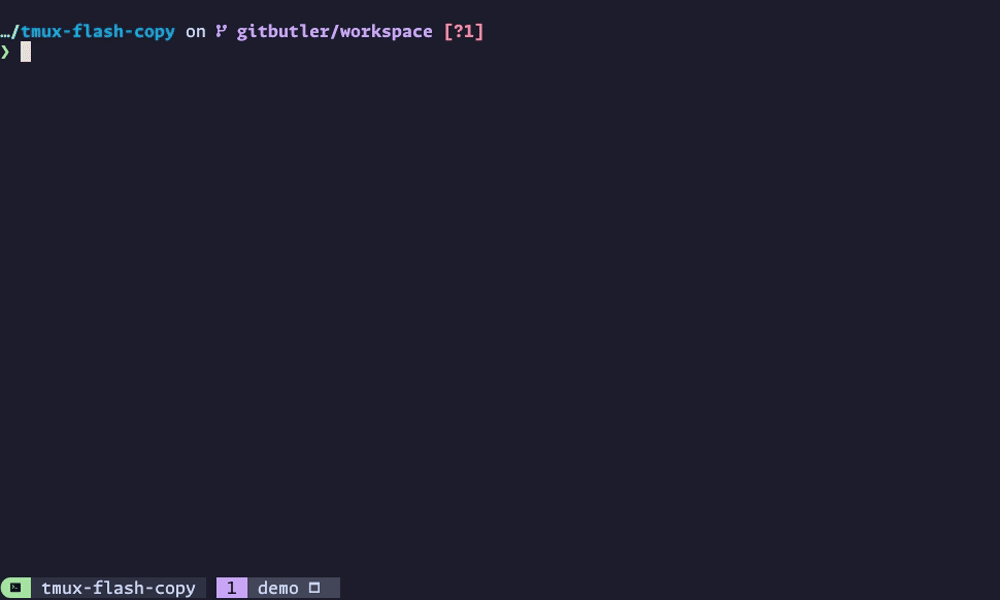

<h1 align="center">
    ⚡📋 TMUX Flash Copy
    <div align="center">
        <a href="https://github.com/Kristijan/flash-copy.tmux/actions/workflows/plugin-testing.yml">
            
        </a>
        <a href="https://codecov.io/gh/Kristijan/flash-copy.tmux">
             
        </a>
        <a href="https://www.gnu.org/licenses/gpl-3.0">
            
        </a>
    </div>
</h1>

A tmux plugin inspired by [flash.nvim](https://github.com/folke/flash.nvim) that enables you to search visible words in the current tmux pane, then copy that word, or a ranged selection, to the system clipboard by pressing the associated label key.



## Features

- **Dynamic Search**: Type to filter words in real-time as you search.
- **Overlay Labels**: Single key selection with labels overlayed on matches in the pane.
- **Dimmed Display**: Non-matching content is dimmed for visual focus.
- **Clipboard Copy**: Selected text is immediately copied to the system clipboard.
- **Auto-paste Modifier**: Use semicolon key as a modifier to automatically paste selected text.
- **Configurable Word Boundaries**: Honours tmux's `word-separators` by default, with override support.

### Table of contents

- [Requirements](#requirements)
- [Installation](#installation)
- [Usage](#usage)
- [Configuration](#configuration)
- [Clipboard implementation](#clipboard-implementation)
- [Debugging](#debugging)
- [Development and testing](#development-and-testing)
- [Demonstration](#demonstration)
- [Contributing](#contributing)
- [Inspiration](#inspiration)
- [Other plugins](#other-plugins)

## Requirements

- [tmux](https://github.com/tmux/tmux) 3.2+ (tested with tmux 3.6a)
- [Python](https://www.python.org) 3.10+ (tested with Python 3.14.2)

## Installation

### Using TPM (recommended)

1. Install [TPM (Tmux Plugin Manager)](https://github.com/tmux-plugins/tpm).

2. Add `tmux-flash-copy` to your `~/.tmux.conf`:

   ```bash
   set -g @plugin 'kristijan/flash-copy.tmux'
   ```

3. Start tmux and install the plugin.

   Press `<tmux_prefix> + I` (capital i, as in Install) to install the plugin.

   Press `<tmux_prefix> + U` (capital u, as in Update) to update the plugin.

### Manual installation

1. Clone this repository to your desired location:

   ```bash
   git clone https://github.com/kristijan/flash-copy.tmux.git ~/.tmux/plugins/flash-copy.tmux
   ```

2. Add the following to your `~/.tmux.conf`:

   ```bash
   run-shell ~/.tmux/plugins/flash-copy.tmux/tmux-flash-copy.tmux
   ```

   Define any customisation options before the `run-shell` line so they are loaded correctly.

   For example:

   ```bash
   set -g @flash-copy-bind-key "f"
   set -g @flash-copy-prompt-indicator "❯"
   run-shell ~/.tmux/plugins/flash-copy.tmux/tmux-flash-copy.tmux
   ```

3. Reload your tmux configuration:

   ```bash
   tmux source-file ~/.tmux.conf
   ```

## Usage

1. Press the bind key (default: `<tmux_prefix> F`, or `<tmux_prefix> Shift+f`) to activate the search.
2. Type to search for words in the pane. The search is dynamic and updates as you type.
3. Matching words will be highlighted in yellow with single-character labels in green.
4. Press the label key corresponding to the word you want to copy.
5. The selected text is immediately copied to your clipboard, and you are returned to your pane.

> [!TIP]
> You can auto-paste your selected match by using the `;` (semicolon) modifier key.
> See the [Auto-paste text](#auto-paste-text) section for more details.

> [!TIP]
> Press `,` (comma) before a label to pin the first endpoint of a text range.
> See the [Copy a range](#copy-a-range) section for the full flow.

### Keybindings when search is active

| Keybinding       | Action                                                                      |
| ---------------- | --------------------------------------------------------------------------- |
| `Ctrl+U`         | Clear the entire search query                                               |
| `Ctrl+W`         | Clear the previous word                                                     |
| `Enter`          | Select the first match (determined by `@flash-copy-reverse-search` setting) |
| `;`+`<label>`    | Copy and auto-paste the word or completed range (if auto-paste enabled)     |
| `,`+`<label>`    | Pin the first endpoint and begin a fresh search for the second endpoint     |
| `Ctrl+C` / `ESC` | Cancel and close the popup without copying                                  |

### Auto-paste text

By default, selecting a label will copy the text to the clipboard only. If auto-paste is enabled (the default), you can also paste the text automatically:

1. Hold `;` (semicolon) (or `Shift+;` (colon) for uppercase labels) to activate the auto-paste modifier
2. Then press the label key to paste a specific word, or `Enter` to paste the first match

The selected text is copied to the clipboard and automatically pasted into your pane.

### Copy a range

Range selection copies both separator-defined endpoint words and everything between them:

1. Search for the first endpoint.
2. Press `,` (comma), then its label. You can also press `,` followed by `Enter` to use the first match.
3. The first endpoint remains pinned with black text on a solid magenta block and the query clears.
4. Search for an endpoint anywhere above or below the first one.
5. Select its label, or press `Enter`, to copy all text between the two endpoints.

For example, endpoints shown as `he<M1>lo w<M2>rld` copy `hello world`. The entire word `hello` is highlighted while the second endpoint is pending. Separators outside the endpoint words are excluded, while separators and newlines between those words are preserved.

Set `@flash-copy-range-copy-mode` to `precise` to use the exact marker boundaries instead. In the same example, precise mode copies `ello w` and highlights the initial `e`. Press `;` before the second label or `Enter` to copy and auto-paste the completed range.

Comma is searchable during the second search. To search for comma normally during the first search, disable range selection or configure a different range key.

## Configuration

See [Configuration](docs/CONFIGURATION.md) for supported options, defaults, and ANSI colour codes.

## Clipboard implementation

See [Clipboard implementation](docs/CLIPBOARD.md) for clipboard methods, troubleshooting, and platform-specific recommendations.

## Debugging

See the [Debugging guide](docs/DEBUGGING.md) for the log format, troubleshooting advice, and example debug sessions.

## Development and testing

See the [Testing guide](docs/TESTING.md) to set up a development environment and run tests and code-quality checks.

See the [Release guide](docs/RELEASING.md) for the versioning, validation, tagging, and publication checklist.

## Demonstration

The following configuration is used in the demonstration GIF.

```bash
set -g @plugin 'kristijan/flash-copy.tmux'
set -g @flash-copy-prompt-indicator "❯"
set -g @flash-copy-prompt-colour "\033[38;2;203;166;247m"
```

### Terminal setup

- Font is [MonaspiceAr Nerd Font Mono](https://github.com/githubnext/monaspace)
- Shell prompt is [starship](https://starship.rs)
- Catppuccin Mocha theme is used for both [tmux](https://github.com/catppuccin/tmux) and [bat](https://github.com/catppuccin/bat).

## Contributing

Contributions are welcome. Feel free to submit issues or pull requests.

Before submitting a PR:

1. Run tests and code quality checks (see the [Testing guide](docs/TESTING.md)).
2. Ensure all tests pass.
3. Add tests for new functionality.
4. Update documentation as needed.

## Inspiration

This plugin is inspired by the excellent [flash.nvim](https://github.com/folke/flash.nvim) plugin for Neovim, adapted for the tmux ecosystem.

## Other plugins

Check out my other plugin, [TMUX FZF Pane Switch](https://github.com/Kristijan/fzf-pane-switch.tmux), which lets you find and switch to any pane in any session using fzf.
